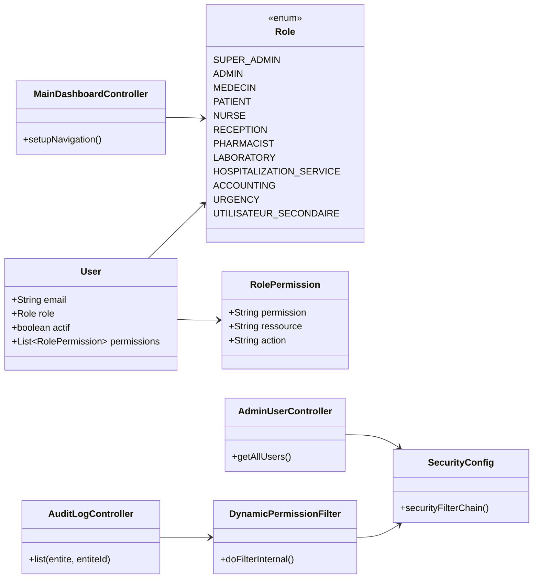
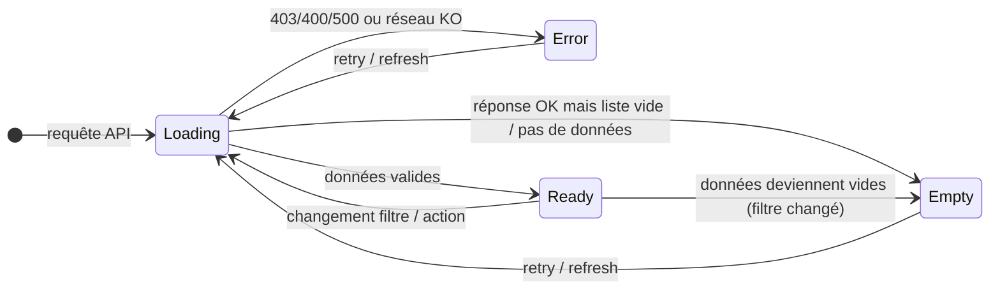
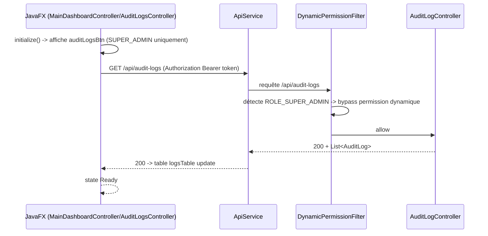
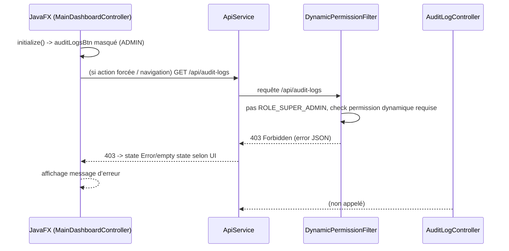

# GinDHO — Todo List “Dashboards par rôles” (RBAC ultra rapide, sécurisé, responsive)
*(Format : sections + tableau • ordre strict • vérifications à chaque étape • multi-agents • basé sur votre structure backend JavaFX/Spring existante.)*

---

## 0) Références & contrats (à utiliser tout au long du doc)

### 0.1 Rôles (backend - source de vérité)
À caler sur `backend/src/main/java/com/gindho/model/Role.java` :
- `SUPER_ADMIN`
- `ADMIN`
- `MEDECIN`
- `PATIENT`
- `NURSE`
- `RECEPTION`
- `PHARMACIST`
- `LABORATORY`
- `HOSPITALIZATION_SERVICE`
- `ACCOUNTING`
- `URGENCY`
- `UTILISATEUR_SECONDAIRE`

### 0.2 Objectif UI commun
Tous les dashboards doivent avoir :
- **Header** : recherche globale, notifications, dark mode, profil
- **Sidebar intelligente** : menus dynamiques selon rôle, collapse, badges
- **Boutons rapides** (raccourcis) + modules visibles **uniquement** selon rôle
- **Widgets & stats** : chargement/empty/error (robust)
- **Responsive** : mobile-first + tablette

### 0.3 “Couleurs / Theme”
- Dashboard `SUPER_ADMIN` :
  - Noir bleuté `#0F172A`
  - Bleu premium `#2563EB`

> Rappel : la UI “brutalist/SaaS” est déjà présente dans vos CSS JavaFX (`style.css`, `dashboard.css`, `base.css`). Cette todo-list organise l’implémentation des règles de rôle + la cohérence UX.

---

## 1) Architecture de travail multi-agents (déploiement en parallèle)

> Vous pouvez exécuter les agents en parallèle, mais **l’intégration** doit suivre l’ordre strict de la section 2.

- **Agent A — RBAC & Mapping Modules/Permissions**
  - Produit : mapping `Role -> Permissions -> Modules -> Actions/Boutons`
  - Produit : règles de visibilité côté UI + filtrage côté API (sécurité)

- **Agent B — Socle Dashboard (Header/Sidebar/Widgets/States)**
  - Produit : composants FXML/contrôleurs “squelette SaaS”
  - Produit : states `loading/empty/error`, widgets stats, topbar actions

- **Agent C — Dashboards Backoffice (SUPER_ADMIN + ADMIN)**
  - Produit : logique + UI SUPER_ADMIN (couleurs premium) + ADMIN

- **Agent D — Dashboards Clinique (MEDECIN + NURSE + RECEPTION + PATIENT)**
  - Produit : UI & modules de workflow clinique

- **Agent E — Dashboards Services & Opérations (LABORATORY + PHARMACIST + HOSPITALIZATION_SERVICE + ACCOUNTING + URGENCY + UTILISATEUR_SECONDAIRE)**
  - Produit : UI & modules d’opérations + sécurité role-based

---

## 2) Ordre strict d’exécution (avec vérifications à chaque étape)

### Étape 1 — Verrouiller le contrat RBAC (Agent A)
**Données à fournir / vérifier**
- Liste des **modules** par dashboard (celle du brief)
- Actions/boutons rapides associés à chaque module
- Mapping final : `Role -> Modules[]` + `Role -> Permissions[]`

**Outils**
- Code backend : Spring Security + filtres existants (`DynamicPermissionFilter`, `SecurityConfig`, etc.)
- Code frontend : contrôle des menus (visibility), boutons, actions

**Livrables**
- Document mapping permissions/modules (dans ce doc ou en annexe)
- Contrat d’API : toutes routes sensibles doivent refuser sans permission

**Vérifications (obligatoires)**
- [ ] Pour chaque `Role`, vérifier que **chaque module** a une permission correspondante
- [ ] Pour chaque `Role`, vérifier que **aucun module** non autorisé n’apparaît dans sidebar/topbar
- [ ] Test sécurité : tenter une action interdite → réponse 403 (pas 200 partiel)

---

### Étape 2 — Construire le socle dashboard SaaS (Agent B)
**Données à intégrer**
- Header commun (recherche, notifications, dark mode, profil)
- Sidebar (menus dynamiques, collapse, badges)
- Widgets stats + sections
- États `loading/empty/error`

**Outils**
- JavaFX FXML + contrôleurs existants (main-dashboard, controllers)
- CSS existants : `javafx-client/src/main/resources/styles/base.css`, `style.css`, `dashboard.css`

**Livrables**
- Composants/structures réutilisables : layout + header/sidebar + zones widgets
- Fonction/Service de “résolution du rôle” pour activer le bon set modules

**Vérifications**
- [ ] Dashboard visible sans erreur à la compilation
- [ ] Header/sidebar présents sur tous rôles
- [ ] Si données vides : pas de `null`, empty state lisible
- [ ] Si erreur API : error state propre (pas de UI blanche)

---

### Étape 3 — Implémenter SUPER_ADMIN (Agent C) *(couleurs + widgets globaux)*
**Modules accessibles**
- Gestion globale plateforme
- Gestion multi-hôpitaux
- Gestion des abonnements
- Gestion des licences
- Gestion des modules + Activation/désactivation
- Gestion utilisateurs : créer admin, suspendre compte, reset mot de passe
- RBAC permissions
- Audit sécurité + Monitoring global temps réel
- KPI globaux + Graphiques revenus
- Hôpitaux actifs / utilisateurs actifs
- Incidents sécurité / alertes système
- Finance globale : revenus, facturation, paiements, rapports financiers
- Dashboard widgets

**Boutons principaux**
- ➕ Ajouter hôpital
- ➕ Ajouter admin
- 📊 Voir analytics
- ⚙️ Configurer système
- 🔒 Gestion sécurité
- 🧾 Rapports

**Outils**
- UI cards/widgets
- Service API : requêtes globales (revenus, utilisateurs, charge serveur, logs)

**Vérifications**
- [ ] Le thème SUPER_ADMIN applique bien `#0F172A` + `#2563EB`
- [ ] Les modules visibles = exact RBAC du mapping
- [ ] Widgets KPI affichent une valeur OU un empty state
- [ ] Actions sensibles (suspend/reset/activation) nécessitent permission

---

### Étape 4 — Implémenter ADMIN (Agent C)
**Modules**
- Gestion hôpital
- Services / départements / chambres
- Personnel / horaires / médical
- Validation dossiers
- Vue globale patients + hospitalisations
- Urgences
- Finance : comptabilité / revenus / factures / assurances
- RH : employés, présences, salaires, contrats

**Widgets & boutons**
- Patients du jour, Consultations, occupation chambres, revenus, alertes urgences
- Activité médecins
- Boutons rapides : ➕ Ajouter personnel, ➕ Ajouter médecin, 🛏️ Gérer chambres, 📊 Rapports, 💰 Voir finances, 🚨 Urgences

**Vérifications**
- [ ] Les composants “finance/comptabilité” ne s’affichent que pour ADMIN
- [ ] Les listes critiques (patients du jour, urgences) ont empty/error state
- [ ] Responsive : colonnes/tables ne débordent pas

---

### Étape 5 — Implémenter MEDECIN (Agent D)
**Modules**
- Consultations (nouvelle consultation, historique patient)
- Diagnostics
- Ordonnances + certificats médicaux
- Examens + demande analyse + voir résultats laboratoire
- Imagerie médicale
- Hospitalisation : admission patient + suivi
- Prescriptions + agenda + rendez-vous + planning + file d’attente

**Boutons rapides**
- ➕ Consultation
- 💊 Prescrire
- 🧪 Demander analyse
- 📄 Générer ordonnance
- 🚨 Signaler urgence

**Vérifications**
- [ ] Les actions “Demander analyse / Générer ordonnance” échangent les bons payloads
- [ ] L’écran “résultats labo” refuse si pas de permission
- [ ] Les urgences déclenchent une notification live filtrée rôle

---

### Étape 6 — Implémenter NURSE (Agent D)
**Modules**
- Constantes vitales
- Administration traitements
- Suivi patients + rapports de garde
- Hospitalisation : attribution lits + surveillance chambres
- Gestion équipements
- Notes infirmières + alertes médecin

**Boutons rapides**
- ❤️ Ajouter constantes
- 💉 Administrer médicament
- 🚨 Alerte urgence
- 📋 Rapport garde

**Vérifications**
- [ ] Les traitements “en attente” et “alertes critiques” ont des états visuels cohérents
- [ ] Le rôle NURSE ne voit pas d’actions MEDECIN non permises

---

### Étape 7 — Implémenter RECEPTION (Agent D)
**Modules**
- Enregistrement patient (scanner carte)
- File d’attente
- Rendez-vous (créer/modifier/orientation patient)
- Paiements : encaissements / tickets / facturation rapide

**Boutons rapides**
- ➕ Nouveau patient
- 📅 Nouveau RDV
- 💳 Encaisser
- 🖨️ Imprimer ticket

**Vérifications**
- [ ] Les flux RDV → patient → paiements sont cohérents
- [ ] “Imprimer ticket” est désactivé/refusé sans permission
- [ ] Mobile : CTA visibles + tailles de boutons OK

---

### Étape 8 — Implémenter PATIENT (Agent D)
**Modules**
- Santé : dossier médical, résultats examens, ordonnances
- Vaccins, historique consultations
- Rendez-vous : réserver + voir calendrier
- Notifications + communication (chat médecin)
- Paiements : mobile money, factures, historique paiements
- Support

**Boutons rapides**
- 📅 Prendre RDV
- 💳 Payer
- 📄 Télécharger ordonnance
- 🧪 Résultats analyses

**Vérifications**
- [ ] Tout ce qui est “clinique interne” reste masqué (RBAC)
- [ ] Téléchargements (ordonnances/résultats) gèrent droits + erreurs
- [ ] Aucun débordement texte sur mobile

---

### Étape 9 — Implémenter LABORATORY (Agent E)
**Modules**
- Analyses : ajouter analyse, résultats, validation examens, historique
- Gestion réactifs + matériel labo
- Statistiques analyses
- Widgets : examens en attente / urgents / résultats validés

**Boutons rapides**
- ➕ Nouvelle analyse
- 📄 Générer résultat
- 🧪 Examens urgents

**Vérifications**
- [ ] Validation résultats = permission LABORATORY stricte
- [ ] “Examens urgents” visibles selon rôle & état

---

### Étape 10 — Implémenter PHARMACIST (Agent E)
**Modules**
- Médicaments, gestion stock, entrées/sorties
- Scanner ordonnance, produits expirés
- Ventes + facturation + historique ventes
- Alertes stock faible / expirants

**Boutons rapides**
- ➕ Ajouter médicament
- 📦 Entrée stock
- ⚠️ Voir alertes
- 🧾 Scanner ordonnance

**Vérifications**
- [ ] Scanner ordonnance vérifie permission et état ordonnance
- [ ] Alertes stock faible ont un trigger exact

---

### Étape 11 — Implémenter HOSPITALIZATION_SERVICE (Agent E)
**Modules**
- Chambres : attribution lits, occupation, disponibilité
- Patients : entrées/sorties, dossiers hospitalisation
- Surveillance + widgets (taux occupation, chambres disponibles)

**Boutons rapides**
- 🛏️ Attribuer lit
- ➕ Hospitaliser
- 📄 Rapport sortie

**Vérifications**
- [ ] Attributions lits bloquées si chambre indisponible
- [ ] Sur hospitalisation, affichage cohérent et sans fuites données

---

### Étape 12 — Implémenter ACCOUNTING (Agent E)
**Modules**
- Comptabilité : factures, revenus, dépenses
- Assurances, paiements (mobile money, carte bancaire)
- Historique transactions + rapports
- Widgets : revenus, paiements en attente, factures impayées

**Boutons rapides**
- 💳 Nouveau paiement
- 📄 Générer facture
- 📊 Rapport financier

**Vérifications**
- [ ] Accès factures/transactions filtré par permission
- [ ] Paiement : erreurs validées (anti double-commit)

---

### Étape 13 — Implémenter URGENCY (Agent E)
**Modules**
- Cas critiques, priorité patients
- Géolocalisation ambulance (si MVP existant/placeholder)
- Monitoring : temps d’intervention, dispo médecins
- État urgences + widgets
**Boutons rapides**
- 🚨 Nouvelle urgence
- 📞 Appeler ambulance
- 🩺 Affecter médecin

**Vérifications**
- [ ] Filtrage live : seule la bonne équipe/permission reçoit les urgences
- [ ] Temps intervention = données valides ou empty state

---

### Étape 14 — Implémenter UTILISATEUR_SECONDAIRE (Agent E)
**But**
- Accès limités selon permission
- Peut avoir accès : lecture consultation, rapports, statistiques, support administratif, archives
- Boutons : 🔍 Rechercher, 📄 Voir dossiers, 📊 Voir stats

**Vérifications**
- [ ] Ce rôle ne doit pas hériter d’actions d’écriture
- [ ] Chaque bouton est gardé via permission

---

## 3) Tableau maître (modules visibles par dashboard + vérif de visibilité)

> Utiliser ce tableau comme “contrat” avant UI.

| Dashboard (Role) | Modules visibles (résumé) | Boutons rapides | Vérifications obligatoires (visibilité) |
|---|---|---|---|
| SUPER_ADMIN | Gestion plateforme, multi-hôpitaux, abonnements/licences, modules/SaaS, utilisateurs + RBAC, audit, monitoring, finance globale, logs | Ajouter hôpital, Ajouter admin, Voir analytics, Config système, Gestion sécurité, Rapports | Sidebar ne montre que ces items; actions sensibles refusent sans permission |
| ADMIN | Hôpital, services/dpts/chambres, personnel/horaires/médical, validation dossiers, patients/jour, hospitalisations, urgences, finance + RH | Ajouter personnel/médecin, Gérer chambres, Rapports, Voir finances, Urgences | Paiements/Compta uniquement pour ADMIN; aucune donnée globale SUPER_ADMIN visible |
| MEDECIN | Consultations/diagnostics, ordonnances/certificats, examens + demande + résultats labo, imagerie, hospitalisation suivi, agenda/RDV/planning | Consultation, Prescrire, Demander analyse, Générer ordonnance, Signaler urgence | Accès écriture ordonnance/examen selon permission; lecture labo filtrée |
| PATIENT | Dossier médical, résultats examens, ordonnances/téléchargements, vaccins, RDV, notifications/chat, paiements (mobile money), support | Prendre RDV, Payer, Télécharger ordonnance, Résultats | Pas d’accès dossier interne; droits download vérifiés |
| NURSE | Constantes vitales, traitements, suivi patients, rapports de garde, attribution lits, surveillance, équipements, notes/alertes médecin | Ajouter constantes, Admin médicament, Alerte urgence, Rapport garde | Lecture/écriture traitement selon permission; alertes critiques visibles |
| RECEPTION | Enregistrement/scanner carte, file attente, RDV, orientation, paiements/tickets/facturation rapide | Nouveau patient, Nouveau RDV, Encaisser, Imprimer ticket | Blocage actions sensibles sans permission; cohérence RDV→paiement |
| PHARMACIST | Stock/entrées-sorties, scanner ordonnance, expirants, ventes + facturation + alertes | Ajouter médicament, Entrée stock, Voir alertes, Scanner ordonnance | Expérience scanner: autorisations strictes; pas d’accès validation médicale |
| LABORATORY | Ajout analyse, résultats, validation, historique, réactifs/matériel, stats | Nouvelle analyse, Générer résultat, Examens urgents | Validation examens permissionnée; urgents filtrés |
| HOSPITALIZATION_SERVICE | Attribution lits, occupation/dispo, hospitalisation entrée/sortie, surveillance + rapport sortie | Attribuer lit, Hospitaliser, Rapport sortie | Blocage attribution impossible; pas de fuite données |
| ACCOUNTING | Factures/revenus/dépenses, assurances, paiements (MM/carte), transactions, rapports | Nouveau paiement, Générer facture, Rapport financier | Aucun accès écriture clinique; anti double paiement |
| URGENCY | Urgences cas critiques, priorité, monitoring temps dispo médecins, état urgences | Nouvelle urgence, Appeler ambulance, Affecter médecin | Notification live filtrée rôle; affectation permissionnée |
| UTILISATEUR_SECONDAIRE | Lecture consultation (selon permission), rapports/stats, support administratif, archives | Rechercher, Voir dossiers, Voir stats | Aucun bouton d’écriture; lecture uniquement |

---

## 4) Checklist de tests & validation (avant “DONE”)

### 4.1 Tests backend sécurité (API)
- [ ] Pour chaque rôle : endpoint d’action non autorisé → 403
- [ ] Pour chaque action critique : payload invalide → 400 (pas 500)
- [ ] Pour chaque action “sensible” (suspend/reset, validation examen, paiement) : audit log créé
- [x] Vérification ciblée audit/admin (seed DB):
  - [x] ADMIN: `GET /api/audit-logs` → **403**
  - [x] SUPER_ADMIN: `GET /api/audit-logs` → **200**
  - [x] ADMIN/SUPER_ADMIN: `GET /api/admin/users` → **200**

### 4.2 Tests frontend JavaFX (compilation + runtime)
- [ ] `mvn -f javafx-client/pom.xml clean compile` passe
- [ ] `mvn -f javafx-client/pom.xml javafx:run` : login OK
- [ ] Pour chaque rôle :
  - [ ] Header/sidebar visible
  - [ ] Modules visibles corrects
  - [ ] Boutons rapides accessibles/cliquables
  - [ ] Table/cards ne débordent pas en resize (au moins une vérif mobile ou petite fenêtre)

### 4.3 Tests “Temps réel / Notifications live” (si activé)
- [ ] Urgence live : seule l’équipe autorisée reçoit
- [ ] Fallback : si WS down → UI affiche error state + retry possible

### 4.4 PWA/React (optionnel si vous basculez sur react-web)
- [ ] Mapping RBAC identique côté react-web
- [ ] UI pages rôle-based identiques (mêmes modules)
- [ ] Tests responsive (mobile/tablette)

---

## 5) Dépendances techniques (à compléter dans le code)
> À mettre à jour pendant l’implémentation.

- [ ] Service “CurrentUserRole + Permissions”
- [ ] UI filtrée par permission (sidebar + bouton + action)
- [ ] API filtrée par permission (pas seulement front)
- [ ] Standardisation CSS composants (header/sidebar/cards/buttons)
- [ ] Gestion states (loading/empty/error)
- [ ] Logs/audit sécurité pour actions sensibles

---

## 6) “Définition de Done” (final)
- [ ] Tous les dashboards affichent header + sidebar + widgets
- [ ] Chaque dashboard montre uniquement ses modules autorisés selon RBAC
- [ ] Les boutons rapides déclenchent les actions correctes
- [ ] Aucun écran cassé au compile/run
- [ ] Responsive OK (desktop + mobile/small)
- [ ] Sécurité : 403 sur actions non autorisées + audit log sur actions sensibles

---

## 7) Diagrammes (Mermaid) — spécifiques GinDHO

### 7.1 Diagramme de classes (RBAC + sécurité API + UI)


### 7.2 Diagramme d’activité (auth + résolution de rôle + affichage)
```mermaid
flowchart TD
A[Start: utilisateur ouvre l’app] --> B[Login / JWT -> token + role]
B --> C[JavaFX MainDashboardController.initialize()]
C --> D{role}
D -->|SUPER_ADMIN| E[Affiche modules: admin + audit logs]
D -->|ADMIN| F[Affiche modules: admin sans audit logs]
D -->|MEDECIN| G[Affiche modules cliniques médecin]
D -->|PATIENT| H[Affiche modules patient (lecture)]
D -->|NURSE| I[Affiche modules nurse]
D -->|RECEPTION| J[Affiche modules réception]
D -->|Autres| K[Affiche modules selon mapping]

E --> L[Appels API: filtre backend via DynamicPermissionFilter]
F --> L
G --> L
H --> L
I --> L
J --> L
K --> L

L --> M{Permission OK ?}
M -->|Oui| N[200 OK + données affichées]
M -->|Non| O[403 Forbidden + UI error/empty state]
```

### 7.3 Diagramme d’états (UI states: loading/empty/error)


### 7.4 Cas d’utilisation (Use cases RBAC)
```mermaid
flowchart TB
actor1[Utilisateur] --> UC1[UC1: Consulter Dashboard selon rôle]
actor1 --> UC2[UC2: Ouvrir Audit Logs (SUPER_ADMIN)]
actor1 --> UC3[UC3: Lister utilisateurs (ADMIN/SUPER_ADMIN)]
actor1 --> UC4[UC4: Voir analyses / urgences (rôles cliniques)]
actor1 --> UC5[UC5: Refus sécurité si permission absente]

UC2 --> RN1[Backend: DynamicPermissionFilter + SecurityConfig]
UC3 --> RN1
UC4 --> RN1
UC5 --> RN2[Retour 403 + message d’erreur JSON]
```

### 7.5 Diagrammes de séquence (2 scénarios spécifiques)

#### 7.5.1 Séquence: SUPER_ADMIN ouvre Audit Logs


#### 7.5.2 Séquence: ADMIN tente Audit Logs (refus sécurité)

Cette phrase signifie essentiellement que le système RBAC défini dans la spécification est beaucoup plus complexe qu'un simple contrôle d'accès par rôle, et qu'il nécessite une cartographie exhaustive entre :

Les endpoints backend
GET /patients/:id
POST /appointments
PUT /laboratory/:id/results
etc.
Les actions métier réelles
consulter un dossier patient
modifier une ordonnance
valider un résultat laboratoire
exporter un rapport
archiver un dossier
Les permissions atomiques
patients.dossier.read
patients.dossier.update
prescriptions.ordonnance.create
lab.resultat.validate
etc.
Les contraintes contextuelles
patient référé au médecin connecté ;
patient appartenant au service de l'utilisateur ;
accès temporaire accordé par délégation ;
plage horaire autorisée ;
établissement (tenant) autorisé.
Exemple concret

Prenons :

GET /api/patients/123

La question est :

Quelle permission permet d'appeler cet endpoint ?

Cela pourrait être :

patients.dossier.read

Mais ce n'est pas suffisant.

Il faut aussi savoir :

Condition 1 : être le médecin référent
OU
Condition 2 : avoir reçu un partage explicite
OU
Condition 3 : être SUPER_ADMIN

Sans cette définition, le moteur RBAC ne sait pas prendre sa décision.

Ce que veut dire « la mapping n'est pas documentée »

Aujourd'hui, les règles sont probablement dispersées dans le code :

if user.role == "MEDECIN":
    ...

ou

if patient.referent_id == user.id:
    ...

ou encore

if user.is_super_admin:
    ...

mais il n'existe pas de document central indiquant :

Endpoint	Permission	Conditions
GET /patients/:id	patients.dossier.read	référent OU partage OU admin
PUT /patients/:id	patients.dossier.update	référent uniquement
POST /laboratory/request	lab.examen.request	médecin uniquement
POST /billing	billing.saisie.create	agent accueil uniquement
Conséquence pour le projet MediCore HMS

Avant d'implémenter un RBAC dynamique complet comme celui décrit dans la spécification, il faut généralement produire :

1. Un catalogue des permissions

Exemple :

patients.dossier.read
patients.dossier.update
patients.dossier.archive
patients.documents.upload
...
2. Une matrice Endpoint → Permission

Exemple :

GET    /patients/:id
=> patients.dossier.read

PUT    /patients/:id
=> patients.dossier.update

POST   /appointments
=> appointments.rdv.create
3. Une matrice des règles contextuelles

Exemple :

patients.dossier.read

ALLOW si :
- SUPER_ADMIN
- médecin référent
- accès partagé actif

DENY sinon
4. Une matrice UI → Permission

Exemple :

Bouton "Nouvelle ordonnance"
=> prescriptions.ordonnance.create

Onglet "Résultats labo"
=> lab.resultat.read

Bouton "Exporter"
=> patients.dossier.export

En résumé, la phrase signifie que la spécification RBAC exige une cartographie détaillée entre l'interface, les permissions et les endpoints, mais que cette cartographie n'existe pas encore de manière explicite dans le code. Sans elle, il est difficile de construire un RBAC dynamique cohérent et vérifiable.

Tu es un expert UI/UX designer, architecte système, product designer senior
et expert en sécurité applicative. Je veux que tu conçoives le système de
design complet, l'architecture de toutes les pages, les spécifications UI/UX,
le système de couleurs, l'iconographie, la typographie, tous les composants,
et le système de contrôle d'accès RBAC dynamique d'un logiciel de gestion
hospitalière full-featured appelé MediCore HMS.

━━━━━━━━━━━━━━━━━━━━━━━━━━━━━━━━━━━━━━━━━━━━━━━━━━━━━━━━━━━━━━━━━━━━━━━
## PARTIE 0 — CONTEXTE GÉNÉRAL DU SYSTÈME
━━━━━━━━━━━━━━━━━━━━━━━━━━━━━━━━━━━━━━━━━━━━━━━━━━━━━━━━━━━━━━━━━━━━━━━

Nom               : MediCore HMS — Hospital Management System
Type              : Application web desktop-first, responsive tablet
Langue            : Français (dates JJ/MM/AAAA, heures HH:MM)
Paiement en ligne : INTERDIT — saisie manuelle uniquement par l'agent
Offline           : Mode hors-ligne partiel (cache local IndexedDB)
Accessibilité     : WCAG 2.1 niveau AA obligatoire sur toutes les pages
Thème             : Clair uniquement (dark mode non requis en V1)
Impression        : Chaque module doit avoir une vue impression @media print
Audit trail       : Chaque action utilisateur est loggée (qui, quoi, quand)
Sessions          : Expiration auto après 30 min d'inactivité avec avertissement
Multi-établissements : Architecture prévue pour gérer plusieurs hôpitaux
                       depuis une instance unique (tenant isolé par hôpital)

━━━━━━━━━━━━━━━━━━━━━━━━━━━━━━━━━━━━━━━━━━━━━━━━━━━━━━━━━━━━━━━━━━━━━━━
## PARTIE 1 — SYSTÈME RBAC DYNAMIQUE COMPLET
━━━━━━━━━━━━━━━━━━━━━━━━━━━━━━━━━━━━━━━━━━━━━━━━━━━━━━━━━━━━━━━━━━━━━━━

### 1.1 DÉFINITION DU RBAC

Le contrôle d'accès est entièrement dynamique. Aucun accès n'est codé en dur.
L'administrateur configure tout depuis l'interface. Le RBAC s'applique à
4 niveaux imbriqués :

  NIVEAU 1 — MODULE       : accès au module entier (visible ou masqué)
  NIVEAU 2 — PAGE         : accès à une page précise dans un module
  NIVEAU 3 — SECTION      : accès à un onglet / bloc dans une page
  NIVEAU 4 — ACTION       : accès à un bouton / champ / opération précise
                            (créer, lire, modifier, supprimer, exporter,
                             imprimer, partager, archiver, valider)

Règles fondamentales :
  - Un utilisateur sans accès à un module ne voit pas ce module dans la sidebar
  - Un utilisateur sans accès à une page reçoit une page 403 personnalisée
  - Un utilisateur sans accès à une action ne voit pas le bouton correspondant
  - Un champ en lecture seule s'affiche grisé et non éditable
  - L'accès peut être limité dans le temps (date début → date fin)
  - L'accès peut être limité à un périmètre géographique (service / unité)
  - L'accès peut être conditionnel (ex: voir les résultats labo uniquement
    si le médecin est le référent du patient)
  - Toute modification de permission est auditée et horodatée

### 1.2 RÔLES SYSTÈME PAR DÉFAUT (modifiables par le SUPER_ADMIN)

  SUPER_ADMIN
    → Accès total à tout sans restriction
    → Seul à pouvoir créer/supprimer des rôles et des utilisateurs
    → Seul à accéder à la configuration système globale
    → Seul à voir les logs de sécurité complets
    → Seul à gérer le mode multi-établissements

  DIRECTEUR
    → Lecture seule sur tous les modules
    → Accès complet aux rapports et statistiques
    → Peut exporter tout en PDF/Excel
    → Ne peut pas créer, modifier ou supprimer de données cliniques
    → Accès au dashboard direction avec KPIs financiers

  MEDECIN
    → Accès complet à ses propres patients uniquement par défaut
    → Peut voir les patients d'un autre médecin si accès partagé explicite
    → Peut créer : consultations, ordonnances, demandes labo, hospitalisations
    → Peut modifier uniquement ses propres saisies
    → Peut valider les résultats labo
    → Ne peut pas accéder au module RH ni à la configuration
    → Ne peut pas voir les données financières

  INFIRMIER
    → Lecture des dossiers patients de son service uniquement
    → Peut saisir : constantes, observations, soins réalisés
    → Peut voir les ordonnances mais pas les créer
    → Peut voir les résultats labo mais pas les valider
    → Peut gérer les lits de son service
    → Ne peut pas archiver, supprimer ou exporter

  AGENT_ACCUEIL
    → Peut créer et modifier les fiches patients (données administratives)
    → Peut gérer les rendez-vous (créer, modifier, annuler)
    → Module paiement : saisie manuelle uniquement
    → Ne peut pas accéder aux données cliniques (ordonnances, labo, hospit)
    → Ne peut pas voir les diagnostics ni les traitements

  LABO_TECHNICIEN
    → Accès au module laboratoire uniquement
    → Peut saisir et modifier les résultats d'analyses
    → Peut imprimer les comptes-rendus
    → Lecture seule sur la fiche patient (nom, prénom, âge uniquement)
    → Ne voit pas les diagnostics ni les ordonnances

  PHARMACIEN
    → Accès au module ordonnances uniquement
    → Peut voir et valider les ordonnances destinées à sa pharmacie
    → Peut marquer une ordonnance comme "délivrée"
    → Ne peut pas créer ni modifier les ordonnances
    → Lecture seule sur nom/prénom patient

  RADIOLOGUE
    → Accès au module imagerie dans le labo
    → Peut uploader et annoter les images radiologiques
    → Lecture seule sur la fiche patient (données cliniques masquées)

  AIDE_SOIGNANT
    → Lecture seule sur les soins planifiés de son service
    → Peut cocher les soins réalisés
    → Aucun accès aux données médicales

### 1.3 PERMISSIONS GRANULAIRES PAR ACTION

Chaque action sur chaque ressource est une permission atomique :

  Notation : MODULE.RESSOURCE.ACTION

  Exemples de permissions :
    patients.dossier.create
    patients.dossier.read
    patients.dossier.update
    patients.dossier.delete
    patients.dossier.archive
    patients.dossier.export
    patients.dossier.share
    patients.allergie.read
    patients.allergie.update
    patients.documents.upload
    patients.documents.delete
    patients.journal_acces.read

    appointments.rdv.create
    appointments.rdv.update
    appointments.rdv.cancel
    appointments.agenda.view_all        (voir tous les médecins)
    appointments.agenda.view_own        (voir seulement son agenda)

    prescriptions.ordonnance.create
    prescriptions.ordonnance.print
    prescriptions.ordonnance.validate   (pharmacien)
    prescriptions.ordonnance.renew

    lab.examen.request
    lab.resultat.enter
    lab.resultat.validate
    lab.resultat.view_critical

    emergency.triage.create
    emergency.triage.update_priority
    emergency.patient.assign

    hospitalization.lit.assign
    hospitalization.lit.release
    hospitalization.sejour.create
    hospitalization.sortie.validate

    hr.personnel.create
    hr.planning.update
    hr.roles.manage                     (SUPER_ADMIN seulement)

    billing.saisie.create               (AGENT_ACCUEIL seulement)
    billing.rapport.view
    billing.rapport.export

    admin.config.update                 (SUPER_ADMIN seulement)
    admin.logs.view
    admin.rbac.manage                   (SUPER_ADMIN seulement)
    admin.backup.trigger

### 1.4 INTERFACE DE GESTION RBAC (pages dédiées)

PAGE RBAC-A — Gestion des rôles
  URL     : /admin/roles
  Accès   : SUPER_ADMIN uniquement
  Contenu :
    - Liste de tous les rôles (système + personnalisés)
    - Badge "Système" sur les rôles non supprimables
    - Bouton "Créer un rôle personnalisé"
    - Bouton "Dupliquer un rôle existant" (pour en dériver un nouveau)
    - Bouton "Voir les utilisateurs de ce rôle"
    - Nombre d'utilisateurs par rôle affiché

PAGE RBAC-B — Éditeur de permissions d'un rôle
  URL     : /admin/roles/:roleId/permissions
  Accès   : SUPER_ADMIN uniquement
  Disposition :
    - Colonne gauche : arbre des modules (accordéon)
      → Cliquer un module déroule ses pages
      → Cliquer une page déroule ses sections et actions
    - Colonne droite : matrice de permissions
      → Lignes = ressources/actions
      → Colonnes = CREATE | READ | UPDATE | DELETE | EXPORT | PRINT | SHARE
      → Toggle switch par cellule (actif/inactif)
      → Case "Périmètre" : Tous | Mon service | Mes patients | Mon unité
      → Case "Validité" : Toujours | De [date] à [date]
    - Bouton "Sauvegarder" avec confirmation
    - Bouton "Réinitialiser aux valeurs par défaut du rôle"
    - Historique des modifications de ce rôle (qui a changé quoi, quand)

PAGE RBAC-C — Gestion des utilisateurs
  URL     : /admin/users
  Accès   : SUPER_ADMIN uniquement
  Contenu :
    - Tableau : Photo | Nom | Matricule | Rôle | Service | Statut | Dernière connexion
    - Filtres : Rôle | Service | Statut (actif/suspendu/expiré)
    - Bouton "Nouvel utilisateur"
    - Actions : Modifier | Suspendre | Réinitialiser MDP | Voir journal
    - Exports CSV

PAGE RBAC-D — Fiche utilisateur
  URL     : /admin/users/:userId
  Accès   : SUPER_ADMIN uniquement
  Contenu :
    - Informations personnelles (nom, matricule, email, téléphone)
    - Rôle principal assigné
    - Rôles supplémentaires (un utilisateur peut avoir plusieurs rôles)
    - Permissions supplémentaires accordées manuellement au-delà du rôle
    - Permissions retirées manuellement en dessous du rôle
    - Services autorisés (périmètre géographique)
    - Horaires d'accès autorisés (plages horaires de connexion)
    - Adresses IP autorisées (optionnel)
    - Historique complet des connexions
    - Historique complet des actions dans le système
    - Bouton "Suspendre l'accès immédiatement"

PAGE RBAC-E — Journal d'audit global
  URL     : /admin/audit
  Accès   : SUPER_ADMIN, DIRECTEUR (lecture)
  Contenu :
    - Filtres : Utilisateur | Module | Action | Date | Résultat (succès/échec)
    - Tableau : Timestamp | Utilisateur | Rôle | IP | Module | Action | Cible | Résultat
    - Accès refusés en rouge
    - Export CSV/PDF signé (non altérable)
    - Rétention configurable (90 jours par défaut)

PAGE RBAC-F — Accès temporaires & délégations
  URL     : /admin/delegations
  Accès   : SUPER_ADMIN, MEDECIN (pour ses propres patients)
  Contenu :
    - Créer un accès temporaire à un dossier ou module
    - Définir : Bénéficiaire | Ressource | Actions autorisées | Période
    - Liste des délégations actives avec timer de countdown
    - Révocation immédiate possible
    - Notification automatique à l'expiration

### 1.5 COMPORTEMENT UI DU RBAC

  Si l'utilisateur n'a pas accès à un MODULE :
    → L'item est absent de la sidebar (pas masqué, vraiment absent)
    → Toute URL directe redirige vers /403

  Si l'utilisateur n'a pas accès à une PAGE :
    → Page 403 personnalisée avec illustration + bouton retour dashboard

  Si l'utilisateur n'a pas accès à une ACTION :
    → Le bouton est absent (pas désactivé, vraiment absent)
    → Exception : boutons "Modifier" visibles mais grisés si lecture seule
      avec tooltip "Vous n'avez pas la permission de modifier"

  Si l'utilisateur n'a pas accès à un CHAMP :
    → Le champ est remplacé par "— — —" en texte gris
    → Aucune valeur sensible n'est transmise au frontend

  Si une session expire :
    → Modal d'avertissement à T-5 minutes ("Votre session expire dans 5 min")
    → Déconnexion automatique à T=0 avec message explicatif
    → Redirection vers /login avec paramètre ?redirect= pour reprendre

━━━━━━━━━━━━━━━━━━━━━━━━━━━━━━━━━━━━━━━━━━━━━━━━━━━━━━━━━━━━━━━━━━━━━━━
## PARTIE 2 — PALETTE DE COULEURS COMPLÈTE
━━━━━━━━━━━━━━━━━━━━━━━━━━━━━━━━━━━━━━━━━━━━━━━━━━━━━━━━━━━━━━━━━━━━━━━

### Couleurs par module (5 nuances chacune)

  Patients       → Bleu     #E6F1FB | #85B7EB | #378ADD | #185FA5 | #0C447C
  Rendez-vous    → Vert     #EAF3DE | #97C459 | #639922 | #3B6D11 | #27500A
  Ordonnances    → Violet   #EEEDFE | #AFA9EC | #7F77DD | #534AB7 | #3C3489
  Urgences       → Rouge    #FCEBEB | #F09595 | #E24B4A | #A32D2D | #791F1F
  Laboratoire    → Teal     #E1F5EE | #5DCAA5 | #1D9E75 | #0F6E56 | #085041
  Hospitalisation→ Ambre    #FAEEDA | #EF9F27 | #BA7517 | #854F0B | #633806
  RH & Personnel → Rose     #FBEAF0 | #ED93B1 | #D4537E | #993556 | #72243E
  Administration → Gris     #F1EFE8 | #B4B2A9 | #888780 | #5F5E5A | #444441
  Paiement manuel→ Gris clair dashed  #F8F7F4 | bordure dashed #B4B2A9

### Couleurs sémantiques

  Succès    → #F0FAF2 | #C6EFD4 | #74D49A | #2D9E5F | #1B5E36
  Erreur    → #FCEBEB | #FFD5D5 | #FF8A80 | #E53935 | #8B1A1A
  Attention → #FAEEDA | #FAC775 | #EF9F27 | #BA7517 | #633806
  Info      → #E6F1FB | #B5D4F4 | #85B7EB | #378ADD | #0C447C
  Inactif   → #F1EFE8 | #D3D1C7 | #B4B2A9 | #888780 | #444441

### Couleurs interface globale

  Fond page          : #F5F4F0
  Fond card          : #FFFFFF
  Fond sidebar       : #FFFFFF
  Fond header        : #FFFFFF
  Bordure défaut     : #E0DED6  (0.5px)
  Bordure hover      : #B4B2A9
  Texte principal    : #1A1A18
  Texte secondaire   : #5F5E5A
  Texte tertiaire    : #888780
  Texte placeholder  : #B4B2A9
  Overlay modal      : rgba(0,0,0,0.45)
  Séparateur         : #EEECE6

━━━━━━━━━━━━━━━━━━━━━━━━━━━━━━━━━━━━━━━━━━━━━━━━━━━━━━━━━━━━━━━━━━━━━━━
## PARTIE 3 — ICONOGRAPHIE
━━━━━━━━━━━━━━━━━━━━━━━━━━━━━━━━━━━━━━━━━━━━━━━━━━━━━━━━━━━━━━━━━━━━━━━

Librairie : Tabler Icons — outline uniquement, jamais filled
CDN CSS   : https://cdn.jsdelivr.net/npm/@tabler/icons-webfont@latest/tabler-icons.min.css
CDN SVG   : https://cdn.jsdelivr.net/npm/@tabler/icons/icons/
Doc       : https://tabler.io/icons
Usage     : <i class="ti ti-[nom]"></i>
Règle     : aria-hidden="true" si décoratif, aria-label="..." si fonctionnel

Icônes par module :
  Patients          : ti-user, ti-users, ti-user-plus, ti-user-search
  Rendez-vous       : ti-calendar, ti-calendar-plus, ti-clock, ti-calendar-check
  Ordonnances       : ti-file-medical, ti-pill, ti-prescription, ti-file-plus
  Urgences          : ti-alert-triangle, ti-ambulance, ti-urgent, ti-heart-rate-monitor
  Laboratoire       : ti-microscope, ti-test-pipe, ti-chart-line, ti-report-medical
  Hospitalisation   : ti-bed, ti-building-hospital, ti-transfer-in, ti-transfer-out
  RH & Personnel    : ti-id-badge, ti-calendar-stats, ti-shield-check, ti-users-group
  Administration    : ti-settings, ti-chart-bar, ti-database, ti-file-export
  Paiement          : ti-pencil, ti-receipt, ti-cash, ti-report
  RBAC              : ti-lock, ti-key, ti-shield, ti-eye-off, ti-user-shield

Icônes statuts cliniques :
  Stable            : ti-check-circle (vert #2D9E5F)
  Surveillance      : ti-eye (ambre #BA7517)
  Critique          : ti-alert-triangle (rouge #E24B4A)
  Inactif/Archivé   : ti-archive (gris #888780)
  Décédé            : ti-ribbon (gris foncé #444441)

Icônes statuts RDV :
  Confirmé          : ti-check (vert)
  En attente        : ti-clock (ambre)
  Annulé            : ti-x (gris)
  Présent           : ti-door-enter (bleu)
  No-show           : ti-user-off (rouge)

Icônes actions globales :
  Créer             : ti-plus
  Modifier          : ti-edit
  Supprimer         : ti-trash
  Archiver          : ti-archive
  Exporter          : ti-download
  Imprimer          : ti-printer
  Partager          : ti-share
  Rechercher        : ti-search
  Filtrer           : ti-filter
  Fermer            : ti-x
  Retour            : ti-arrow-left
  Voir              : ti-eye
  Masquer           : ti-eye-off
  Alerte            : ti-bell
  Succès            : ti-check
  Erreur            : ti-alert-circle
  Info              : ti-info-circle
  Verrouillé        : ti-lock
  Permission refusée: ti-lock-off

Tailles d'icônes :
  Dans sidebar      : 20px
  Dans bouton       : 16px
  Dans badge        : 14px
  Illustration vide : 64px
  Icône de page     : 32px

━━━━━━━━━━━━━━━━━━━━━━━━━━━━━━━━━━━━━━━━━━━━━━━━━━━━━━━━━━━━━━━━━━━━━━━
## PARTIE 4 — TYPOGRAPHIE
━━━━━━━━━━━━━━━━━━━━━━━━━━━━━━━━━━━━━━━━━━━━━━━━━━━━━━━━━━━━━━━━━━━━━━━

Polices :
  Interface     : Inter (Google Fonts)
  Mono/Codes    : JetBrains Mono (codes hex, IDs, matricules, résultats labo)
  CDN Inter     : https://fonts.googleapis.com/css2?family=Inter:wght@400;500;700
  CDN Mono      : https://fonts.googleapis.com/css2?family=JetBrains+Mono:wght@400;500

Échelle typographique :
  Display       : 32px / weight 700 / line-height 1.2  (titres de page principale)
  H1            : 26px / weight 700 / line-height 1.3
  H2            : 20px / weight 500 / line-height 1.4
  H3            : 16px / weight 500 / line-height 1.5
  Body large    : 15px / weight 400 / line-height 1.7
  Body          : 14px / weight 400 / line-height 1.6
  Small         : 12px / weight 400 / line-height 1.5
  Label         : 11px / weight 500 / uppercase / letter-spacing 0.06em
  Badge         : 11px / weight 500 / line-height 1
  Mono          : 13px / JetBrains Mono (résultats, IDs, codes)

Règles :
  - Jamais de font-weight 600 (trop lourd dans l'interface médicale)
  - Les labels de formulaire : 12px uppercase, letter-spacing 0.05em
  - Les valeurs critiques (résultats anormaux) : mono 13px gras rouge
  - Les codes patient / numéros dossier : mono #5F5E5A
  - Jamais de text-transform uppercase sur les titres H1/H2

━━━━━━━━━━━━━━━━━━━━━━━━━━━━━━━━━━━━━━━━━━━━━━━━━━━━━━━━━━━━━━━━━━━━━━━
## PARTIE 5 — LAYOUT GLOBAL & NAVIGATION
━━━━━━━━━━━━━━━━━━━━━━━━━━━━━━━━━━━━━━━━━━━━━━━━━━━━━━━━━━━━━━━━━━━━━━━

### Structure de page type

  ┌─────────────────────────────────────────────────────────┐
  │  HEADER  (100% largeur, 60px fixe, z-index 100)         │
  ├──────────────┬──────────────────────────────────────────┤
  │              │                                          │
  │   SIDEBAR    │         ZONE CONTENU PRINCIPALE          │
  │   240px      │         (flex 1, overflow-y auto)        │
  │   fixe       │         padding 24px                     │
  │              │         max-width 1200px centré          │
  │              │                                          │
  │              │                                          │
  └──────────────┴──────────────────────────────────────────┘

Header (60px, fond blanc, border-bottom 0.5px #E0DED6) :
  Gauche  : Logo MediCore HMS + nom établissement
  Centre  : Barre de recherche globale (patients, RDV, dossiers)
  Droite  : Icône notifications (ti-bell) + badge count rouge
            Icône aide (ti-help-circle)
            Avatar utilisateur + nom + rôle + menu déroulant
            Menu déroulant : Profil | Paramètres | Déconnexion

Sidebar (240px, fond blanc, border-right 0.5px #E0DED6) :
  - Modules visibles uniquement si permissions RBAC accordées
  - Item actif : fond couleur module 10% + bordure gauche 3px + texte coloré
  - Item hover : fond #F5F4F0
  - Icône 20px + label 14px, padding 10px 16px
  - Sections regroupées par catégorie avec séparateur
  - Section clinique : Patients | RDV | Ordonnances | Urgences | Labo | Hospit
  - Section gestion  : RH & Personnel | Administration | Rapports
  - Section finance  : Facturation (paiement manuel)
  - Section sécurité : RBAC | Journal d'audit (SUPER_ADMIN seulement)
  - En bas de sidebar : Version logiciel + nom utilisateur connecté + bouton déco

Grille contenu :
  - 12 colonnes, gutter 16px, margin-left 0, max-width 1200px
  - Cards grille : repeat(auto-fill, minmax(280px, 1fr)), gap 16px
  - Breakpoint tablet (768px) : sidebar collapse en icônes 56px
  - Breakpoint mobile (375px) : sidebar drawer overlay

### Fil d'Ariane (breadcrumb)
  Affiché sur toutes les pages sauf dashboard
  Format : Module > Page > Sous-page
  Exemple : Patients > Fiche patient > Ordonnances
  Cliquable sur chaque niveau

━━━━━━━━━━━━━━━━━━━━━━━━━━━━━━━━━━━━━━━━━━━━━━━━━━━━━━━━━━━━━━━━━━━━━━━
## PARTIE 6 — ARCHITECTURE COMPLÈTE DES 57 PAGES
━━━━━━━━━━━━━━━━━━━━━━━━━━━━━━━━━━━━━━━━━━━━━━━━━━━━━━━━━━━━━━━━━━━━━━━

### MODULE AUTH — 3 pages

  P01 /login
    Disposition  : 2 colonnes (illustration gauche 55%, formulaire droite 45%)
    Gauche       : Illustration SVG médicale, nom système, slogan, version
    Droite       : Logo hôpital, titre, champ identifiant, champ MDP +
                   toggle show/hide, checkbox "Se souvenir", lien MDP oublié,
                   bouton "Se connecter", message erreur inline, footer établissement
    RBAC         : Aucun (public)

  P02 /login/forgot-password
    Disposition  : Centré, card 480px, illustration ti-mail 48px
    Contenu      : Champ email/matricule, bouton envoi, confirmation après envoi
    RBAC         : Aucun (public)

  P03 /login/reset-password
    Disposition  : Centré, card 480px
    Contenu      : Nouveau MDP + règles visibles, confirmation, jauge de force,
                   bouton enregistrer, affichage expiration token
    RBAC         : Aucun (token)

### MODULE DASHBOARD — 2 pages

  P04 /dashboard
    Disposition  : Layout standard, blocs empilés
    Bloc 1       : Bandeau bienvenue (nom, date, heure temps réel, 2 boutons accès rapide)
    Bloc 2       : 4 métriques clés en grille (patients jour, consultations,
                   occupation lits, temps attente urgences)
    Bloc 3       : Bandeau alertes critiques (conditionnel, visible si alertes)
    Bloc 4       : Grille 3 colonnes (graphiques 50% + prochains RDV 25% + donut lits 25%)
    Bloc 5       : Tableau 10 dernières activités (heure, action, module, user, statut)
    RBAC         : Tous — contenu filtré par rôle (médecin voit ses RDV,
                   directeur voit les KPIs, agent voit les admissions)

  P05 /dashboard/direction
    Disposition  : Layout standard, focus KPIs
    Contenu      : KPIs financiers (recettes saisies), qualité, graphiques
                   comparatifs, export rapport mensuel
    RBAC         : DIRECTEUR, SUPER_ADMIN

### MODULE PATIENTS — 7 pages

  P06 /patients
    Disposition  : Toolbar + tableau + pagination
    Toolbar      : Recherche (nom/prénom/dossier/tel) + filtres (service,
                   statut, médecin, âge) + bouton "Nouveau patient"
    Tableau      : Initiales | N°Dossier | Nom Prénom | Âge | Sexe |
                   Médecin | Dernier RDV | Statut | Actions
    Actions      : Voir | Modifier | Archiver (selon RBAC)
    Pagination   : 20/page, total, export CSV/PDF
    RBAC         : patients.dossier.read minimum requis
                   "Nouveau patient" visible si patients.dossier.create
                   "Archiver" visible si patients.dossier.archive

  P07 /patients/new — /patients/:id/edit
    Disposition  : Stepper 4 étapes (barre progression en haut)
    Étape 1      : Identité (photo, nom, prénom, naissance, sexe, nationalité, CNI)
    Étape 2      : Contact (tél, email, adresse, contact urgence)
    Étape 3      : Médical (groupe sanguin, allergies, maladies chroniques,
                   médecin référent, mutuelle)
    Étape 4      : Récap + consentement RGPD + enregistrement
    RBAC         : patients.dossier.create ou patients.dossier.update
                   Champs médicaux masqués si pas patients.allergie.read

  P08 /patients/:id
    Disposition  : Header patient fixe + 7 onglets
    Header       : Photo/initiales, nom, âge, sexe, N°dossier, groupe sanguin,
                   allergies (badges), statut clinique, médecin référent,
                   boutons (Modifier | Nouveau RDV | Ordonnance | Hospitaliser)
                   Boutons visibles uniquement si permissions correspondantes
    Onglet 1     : Vue générale (résumé, dernière consult, RDV prochains, traitements)
    Onglet 2     : Historique consultations (timeline, filtres date/médecin)
    Onglet 3     : Ordonnances (liste, statut, impression)
    Onglet 4     : Résultats labo & imagerie (tableau, valeurs normales/anormales, PJ)
    Onglet 5     : Hospitalisations (historique séjours)
    Onglet 6     : Documents (upload, prévisualisation)
    Onglet 7     : Journal d'accès (qui a vu ce dossier — RGPD)
    RBAC         : Chaque onglet conditionné par permission spécifique
                   Onglet masqué si utilisateur n'a pas la permission de section

  P09 /patients/search
    Disposition  : Panneau filtres gauche 280px + résultats droite
    Filtres      : Nom/prénom/dossier/tél/email | Âge min-max |
                   Groupe sanguin | Maladie | Médecin | Service |
                   Dernière visite | Statut | Hospitalisé actuellement
    RBAC         : patients.dossier.read

  P10 /patients/:id/share
    Disposition  : Card liste partages + formulaire ajout
    Contenu      : Services/médecins avec accès, accorder/révoquer,
                   durée limitée, journal partages
    RBAC         : patients.dossier.share (MEDECIN référent seulement)

  P11 /patients/archived
    Disposition  : Même que P06 avec filtre "archivé" forcé
    Actions      : Désarchiver | Supprimer définitivement (SUPER_ADMIN)
    RBAC         : patients.dossier.archive

  P12 /patients/:id/constantes
    Disposition  : Formulaire saisie + graphiques historique
    Contenu      : Température, tension, poids, taille, SpO2, fréquence cardiaque
                   Graphiques évolution dans le temps
    RBAC         : patients.constantes.create (INFIRMIER, MEDECIN)

### MODULE RENDEZ-VOUS — 4 pages

  P13 /appointments
    Disposition  : Vue calendrier + panneau latéral droit 320px
    Calendrier   : Switch Jour/Semaine/Mois/Liste, filtres médecin/service
                   Couleurs par statut : confirmé vert | attente ambre |
                   annulé gris | urgence rouge
    Panneau droit: Formulaire création RDV rapide
    RBAC         : appointments.agenda.view_all ou view_own selon rôle
                   Médecin voit son agenda uniquement par défaut

  P14 /appointments/new — /appointments/:id/edit
    Disposition  : Formulaire card centré
    Contenu      : Patient (recherche autocomplete) | Date & heure |
                   Médecin | Service | Type consultation | Motif |
                   Durée | Notes internes | Statut | Rappel SMS/email
    RBAC         : appointments.rdv.create ou update

  P15 /appointments/:id
    Disposition  : Card détail RDV
    Contenu      : Toutes les infos + historique modifications + boutons
                   Confirmer | Annuler | Reprogrammer | Patient arrivé |
                   Générer compte-rendu
    RBAC         : Actions conditionnées par permissions spécifiques

  P16 /appointments/stats
    Disposition  : Graphiques et tableaux
    Contenu      : Taux no-show, RDV par médecin, par service, par mois
                   Peak hours, durée moyenne consultation
    RBAC         : appointments.stats.view (DIRECTEUR, SUPER_ADMIN, MEDECIN chef)

### MODULE ORDONNANCES — 4 pages

  P17 /prescriptions
    Disposition  : Toolbar + liste cards ordonnances
    Filtres      : Patient | Médecin | Statut (active/expirée/renouvelée/délivrée)
                   Date | Médicament
    Card ordonnance : Patient, médecin, date, médicaments (preview 2 items),
                      statut, actions (Voir | Imprimer | Renouveler)
    RBAC         : prescriptions.ordonnance.read

  P18 /prescriptions/new — /prescriptions/:id/edit
    Disposition  : Formulaire + panneau prévisualisation droite
    Contenu      : Patient (autocomplete) | Médecin (auto si connecté) |
                   Date | Médicaments (ajout dynamique ligne par ligne :
                   nom médicament, dosage, forme, posologie, durée, quantité)
                   Alerte interaction médicamenteuse automatique |
                   Instructions spéciales | Validité (jours) | Renouvellement
                   Prévisualisation impression temps réel
    RBAC         : prescriptions.ordonnance.create (MEDECIN seulement)

  P19 /prescriptions/:id
    Disposition  : Card ordonnance complète + historique + actions
    Contenu      : Tous les détails + QR code vérification + historique
                   délivrances + timeline renouvellements
    Actions      : Imprimer | Renouveler | Marquer délivrée | Annuler
    RBAC         : Actions filtrées (PHARMACIEN peut "marquer délivrée",
                   MEDECIN peut renouveler, agent ne peut qu'imprimer)

  P20 /prescriptions/interactions
    Disposition  : Outil de vérification standalone
    Contenu      : Saisir N médicaments, afficher interactions connues
                   Niveaux : Critique (rouge) | Modéré (ambre) | Mineur (vert)
    RBAC         : prescriptions.interactions.check (MEDECIN, PHARMACIEN)

### MODULE URGENCES — 4 pages

  P21 /emergency
    Disposition  : Vue temps réel, grille urgences, actualisation auto 30s
    Bloc 1       : Compteurs (patients en attente, en soin, temps moyen)
    Bloc 2       : File d'attente triée par priorité
                   Chaque ligne : P1-P5 badge coloré | Nom | Âge | Motif |
                   Temps d'attente | Médecin assigné | Statut | Actions
    Bloc 3       : Vue boxes/salles (occupation temps réel)
    Code couleur : P1 rouge foncé | P2 rouge | P3 ambre | P4 vert | P5 bleu
    RBAC         : emergency.triage.read

  P22 /emergency/triage/new
    Disposition  : Formulaire rapide (optimisé pour saisie rapide)
    Contenu      : Patient (recherche ou création rapide) | Motif arrivée |
                   Constantes initiales (T°, TA, SpO2, FC) |
                   Niveau priorité P1-P5 (sélecteur visuel grand format) |
                   Médecin assigné | Box/salle | Notes triage
    RBAC         : emergency.triage.create (INFIRMIER, MEDECIN)

  P23 /emergency/:id
    Disposition  : Fiche urgence temps réel
    Contenu      : Identité patient | Priorité (modifiable) | Timeline
                   interventions | Constantes en temps réel | Médecin |
                   Médicaments administrés | Examens demandés |
                   Bouton "Transférer en hospitalisation" | Bouton "Sortie"
    RBAC         : emergency.triage.update_priority (MEDECIN, INFIRMIER chef)

  P24 /emergency/stats
    Disposition  : Tableaux de bord urgences
    Contenu      : Pics d'affluence par heure/jour | Durée moyenne prise en charge
                   par priorité | Taux de transfert hospitalisation |
                   Motifs les plus fréquents
    RBAC         : DIRECTEUR, SUPER_ADMIN, MEDECIN chef urgences

### MODULE LABORATOIRE — 5 pages

  P25 /laboratory
    Disposition  : Toolbar + tableau examens
    Filtres      : Patient | Type examen | Statut | Date | Médecin demandeur
                   Résultats anormaux (toggle)
    Tableau      : N°Examen | Patient | Type | Demandé par | Date demande |
                   Statut | Résultat | Actions
    Badge statut : En attente (ambre) | En cours (bleu) | Disponible (vert) |
                   Anormal (rouge clignotant doux)
    RBAC         : lab.resultat.read

  P26 /laboratory/request/new
    Disposition  : Formulaire card
    Contenu      : Patient | Médecin demandeur (auto) | Type(s) analyse
                   (multi-select avec catégories : biologie, bactério, imagerie) |
                   Urgence (normale/urgente/très urgente) | Instructions spéciales |
                   Date souhaitée
    RBAC         : lab.examen.request (MEDECIN)

  P27 /laboratory/:id/enter-results
    Disposition  : Formulaire saisie résultats + valeurs de référence en colonne
    Contenu      : Pour chaque paramètre : valeur saisie | unité | plage normale |
                   indicateur automatique normal/anormal/critique |
                   Commentaire technicien | Upload fichiers (images, PDF)
                   Bouton "Soumettre pour validation"
    RBAC         : lab.resultat.enter (LABO_TECHNICIEN)

  P28 /laboratory/:id
    Disposition  : Résultat complet + historique patient + actions
    Contenu      : Tous les paramètres avec code couleur | Graphique évolution
                   vs résultats précédents | Commentaire médecin |
                   Statut validation | Bouton imprimer compte-rendu
    RBAC         : lab.resultat.view_critical (valeurs critiques masquées
                   si pas la permission, affichées "— — —")

  P29 /laboratory/imaging
    Disposition  : Galerie images médicales + visionneuse
    Contenu      : Upload images DICOM/JPG/PDF | Annotations radiologues |
                   Visionneuse inline (zoom, contraste) | Liaison au dossier patient
    RBAC         : lab.imagerie.upload (RADIOLOGUE), lab.imagerie.read (MEDECIN)

### MODULE HOSPITALISATION — 5 pages

  P30 /hospitalization
    Disposition  : Vue carte de l'hôpital + liste lits
    Carte        : Représentation visuelle des services et étages
                   Lits colorés : libre (vert) | occupé (rouge) |
                   nettoyage (ambre) | réservé (bleu)
    Liste        : Filtres par service, statut, médecin |
                   Tableau : Lit | Service | Patient | Médecin | Depuis | DMS | Actions
    RBAC         : hospitalization.lit.read

  P31 /hospitalization/admit
    Disposition  : Formulaire admission
    Contenu      : Patient (recherche) | Service | Lit (select lits libres) |
                   Médecin responsable | Motif hospitalisation | Date entrée |
                   Type séjour (programmé/urgence/transfert) | Mutuelle |
                   Chambre individuelle/partagée
    RBAC         : hospitalization.sejour.create (MEDECIN, AGENT_ACCUEIL)

  P32 /hospitalization/:id
    Disposition  : Fiche séjour + onglets
    Header       : Patient, lit, service, médecin, date entrée, DMS actuelle
    Onglet 1     : Évolution clinique (notes quotidiennes médecins/infirmiers)
    Onglet 2     : Soins planifiés & réalisés (checklist quotidienne)
    Onglet 3     : Médicaments administrés (liste horodatée)
    Onglet 4     : Examens demandés et résultats
    Onglet 5     : Documents (ordonnances, comptes-rendus)
    Boutons      : Modifier lit | Transférer service | Préparer sortie
    RBAC         : Onglets conditionnés par permissions de section

  P33 /hospitalization/:id/discharge
    Disposition  : Formulaire sortie en étapes
    Étape 1      : Date & heure sortie | Type (guérison/transfert/décès/AMA)
    Étape 2      : Compte-rendu hospitalisation (éditeur texte riche)
    Étape 3      : Ordonnance de sortie
    Étape 4      : Lettre de liaison médecin traitant
    Étape 5      : Validation finale + libération du lit automatique
    RBAC         : hospitalization.sortie.validate (MEDECIN)

  P34 /hospitalization/stats
    Disposition  : Tableaux de bord occupation
    Contenu      : Taux occupation temps réel | DMS par service | Rotation lits |
                   Graphique occupation sur 30 jours | Comparatif services
    RBAC         : DIRECTEUR, SUPER_ADMIN, chefs de service

### MODULE RH & PERSONNEL — 5 pages

  P35 /hr/staff
    Disposition  : Toolbar + grille cards personnel ou tableau (toggle)
    Filtres      : Service | Rôle | Spécialité | Disponibilité
    Card staff   : Photo/initiales | Nom | Spécialité | Service |
                   Statut (disponible/en garde/congé) | Contact | Actions
    RBAC         : hr.personnel.read (SUPER_ADMIN, DIRECTEUR, chef service)

  P36 /hr/staff/new — /hr/staff/:id/edit
    Disposition  : Formulaire sections
    Section 1    : Identité (photo, nom, prénom, date naissance, sexe)
    Section 2    : Professionnel (matricule, spécialité, titre, service,
                   date embauche, type contrat)
    Section 3    : Contact (tél, email professionnel, adresse)
    Section 4    : Accès système (créer compte utilisateur, assigner rôle RBAC)
    Section 5    : Documents (diplômes, contrat, pièce identité)
    RBAC         : hr.personnel.create ou update

  P37 /hr/staff/:id
    Disposition  : Profil complet + onglets
    Onglets      : Informations | Planning | Gardes | Documents | Journal accès
    RBAC         : hr.personnel.read, Section 4 (compte système) → SUPER_ADMIN

  P38 /hr/planning
    Disposition  : Calendrier planning par service
    Contenu      : Vue semaine par défaut | Glisser-déposer gardes |
                   Filtres service/spécialité | Détection conflits automatique |
                   Export planning PDF semaine/mois
    RBAC         : hr.planning.read, hr.planning.update (chef service, SUPER_ADMIN)

  P39 /hr/leaves
    Disposition  : Tableau demandes congés + calendrier
    Contenu      : Liste demandes (en attente/approuvée/refusée) |
                   Solde congés par agent | Validation chef service |
                   Impact sur planning (alertes si sous-effectif)
    RBAC         : hr.conges.manage

### MODULE ADMINISTRATION & RAPPORTS — 6 pages

  P40 /admin/reports
    Disposition  : Catalogue de rapports par catégorie
    Catégories   : Activité clinique | Finance | Personnel | Qualité | RGPD
    Chaque rapport : Nom | Description | Dernière génération | Bouton générer |
                     Bouton télécharger (PDF/Excel)
    RBAC         : admin.rapports.view, admin.rapports.export

  P41 /admin/reports/:reportId
    Disposition  : Rapport affiché inline + contrôles
    Contenu      : Filtres période, service, médecin | Graphiques interactifs |
                   Tableau de données | Boutons export PDF/Excel/CSV
    RBAC         : admin.rapports.view

  P42 /admin/config
    Disposition  : Sections accordéon de configuration
    Sections     :
      Établissement  : Nom, logo, adresse, contacts, horaires
      Modules actifs : Toggle activation de chaque module
      Numérotation   : Format N° dossier, N° examen, N° ordonnance
      Notifications  : Configuration SMS/email (templates, déclencheurs)
      Sauvegardes    : Fréquence, destination, dernier backup, restauration
      Multi-sites    : Gestion établissements secondaires
    RBAC         : admin.config.update (SUPER_ADMIN seulement)

  P43 /admin/notifications
    Disposition  : Liste notifications système + configuration
    Contenu      : Types de notifications (RDV, résultats, alertes critiques) |
                   Canaux (SMS, email, in-app) | Templates éditables |
                   Historique envois
    RBAC         : admin.notifications.manage

  P44 /admin/backup
    Disposition  : Tableau bord sauvegardes
    Contenu      : Dernière sauvegarde (date, taille, statut) |
                   Historique 30 derniers backups | Bouton sauvegarde manuelle |
                   Télécharger backup | Restaurer (avec confirmation forte)
    RBAC         : admin.backup.trigger (SUPER_ADMIN)

  P45 /admin/system-logs
    Disposition  : Tableau logs filtrables
    Contenu      : Logs système (erreurs, warnings, info) | Filtres niveau/date |
                   Logs d'accès API | Export
    RBAC         : admin.logs.view (SUPER_ADMIN)

### MODULE FACTURATION — 3 pages (saisie manuelle uniquement)

  P46 /billing
    Disposition  : Toolbar + tableau factures
    Bandeau      : "Aucune transaction en ligne — données saisies manuellement"
                   (fond #F8F7F4, icône ti-pencil, bordure dashed)
    Filtres      : Patient | Date | Statut (saisie/validée/impayée) | Agent
    Tableau      : N°Facture | Patient | Date soin | Montant | Mode règlement |
                   Agent saisie | Statut | Actions
    RBAC         : billing.saisie.read (AGENT_ACCUEIL, DIRECTEUR, SUPER_ADMIN)

  P47 /billing/entry/new — /billing/entry/:id/edit
    Disposition  : Formulaire card avec bandeau avertissement en haut
    Bandeau      : "Saisie manuelle — Vérifiez les informations avant validation"
    Contenu      :
      - Patient (recherche autocomplete)
      - Date du soin
      - Actes facturés (ajout ligne par ligne : acte, quantité, prix unitaire)
      - Sous-total calculé automatiquement
      - Mode de règlement : Espèces | Chèque | Virement | Mobile Money |
                            Assurance/Mutuelle | Autre
      - Montant reçu | Rendu monnaie (calculé)
      - Référence paiement (numéro chèque, référence virement)
      - Agent de caisse (auto = utilisateur connecté)
      - Notes
      - Bouton "Enregistrer la saisie" (pas "Payer")
    Interdictions: Aucun bouton "Payer en ligne", aucun champ carte bancaire,
                   aucune intégration payment gateway
    RBAC         : billing.saisie.create (AGENT_ACCUEIL seulement)

  P48 /billing/reports
    Disposition  : Rapports financiers (lecture seule)
    Contenu      : Recettes par période, par mode règlement, par service |
                   Factures impayées | Graphiques mensuels |
                   Export PDF signé + Excel
    RBAC         : billing.rapport.view (DIRECTEUR, SUPER_ADMIN)
                   billing.rapport.export (DIRECTEUR, SUPER_ADMIN)

### MODULE RBAC — 6 pages (voir Partie 1 pour le détail)

  P49 /admin/roles                    Gestion des rôles
  P50 /admin/roles/:id/permissions    Éditeur permissions
  P51 /admin/users                    Liste utilisateurs
  P52 /admin/users/:id                Fiche utilisateur
  P53 /admin/audit                    Journal d'audit global
  P54 /admin/delegations              Accès temporaires

### PAGES SYSTÈME — 3 pages

  P55 /403
    Contenu      : Illustration ti-lock 64px | "Accès refusé" | Explication |
                   Bouton retour dashboard | Lien contacter administrateur
    Note         : Jamais un message vague — toujours expliquer pourquoi

  P56 /404
    Contenu      : Illustration ti-map-search 64px | "Page introuvable" |
                   Bouton retour dashboard | Barre recherche

  P57 /500
    Contenu      : Illustration ti-server-off 64px | "Erreur serveur" |
                   Message technique (mode dev) | Bouton réessayer |
                   Contact support

━━━━━━━━━━━━━━━━━━━━━━━━━━━━━━━━━━━━━━━━━━━━━━━━━━━━━━━━━━━━━━━━━━━━━━━
## PARTIE 7 — COMPOSANTS UI EXHAUSTIFS
━━━━━━━━━━━━━━━━━━━━━━━━━━━━━━━━━━━━━━━━━━━━━━━━━━━━━━━━━━━━━━━━━━━━━━━

### Boutons
  Primaire     : fond couleur module, texte blanc, radius 8px, padding 10px 20px
  Secondaire   : fond transparent, bordure 1px couleur module, texte couleur module
  Danger       : fond #E53935, texte blanc (supprimer, archiver définitivement)
  Ghost        : fond transparent, pas de bordure, texte couleur module
  Désactivé    : fond #D3D1C7, texte #888780, cursor not-allowed
  Icône seul   : 36x36px, radius 8px, fond transparent, bordure hover
  États        : hover (+8% foncé), active (scale 0.98), focus (ring 2px offset 2px)
  Avec icône   : icône 16px à gauche du label, gap 8px

### Formulaires
  Input        : hauteur 38px, bordure 1px #E0DED6, radius 8px, padding 0 14px
  Input focus  : bordure 2px couleur module, ring couleur module 30% opacité
  Input erreur : bordure #E53935, fond #FFF5F5, message erreur 12px rouge dessous
  Input succès : bordure #2D9E5F, fond #F0FAF2
  Input disabled: fond #F5F4F0, texte #B4B2A9, cursor not-allowed
  Label        : 11px uppercase, weight 500, letter-spacing 0.06em, #5F5E5A, margin-bottom 6px
  Placeholder  : #B4B2A9
  Select       : même style que input + chevron ti-chevron-down à droite
  Textarea     : min-height 100px, resize vertical uniquement
  Checkbox     : 16px, radius 4px, coché couleur module
  Radio        : 16px, cercle, sélectionné couleur module
  Toggle       : 40x22px, actif couleur module, inactif #D3D1C7, transition 0.2s
  Date picker  : input + calendrier dropdown, locale française
  Autocomplete : dropdown résultats max 6 items, highlight match, loading spinner

### Tableaux
  Header       : fond #F5F4F0, texte #444441 11px uppercase, border-bottom 1px
  Ligne pair   : fond #FFFFFF
  Ligne impair : fond #FAFAF8
  Ligne hover  : fond couleur module 6% opacité
  Ligne critique: fond #FCEBEB, border-left 3px #E24B4A
  Cellule      : padding 12px 16px, border-bottom 0.5px #EEECE6
  Actions col  : icônes actions alignées droite, visibles au hover
  Tri          : icône ti-arrows-sort dans header cliquable, actif coloré
  Pagination   : précédent | 1 2 3 ... N | suivant, items par page select
  État vide    : illustration + message + bouton action centré

### Badges & Tags
  Module       : fond couleur module 15% | texte couleur module foncé | radius 999px | 11px
  Statut patient: Stable (vert) | Surveillance (ambre) | Critique (rouge) | Inactif (gris)
  Priorité P1  : fond #791F1F, texte blanc, 11px bold
  Priorité P2  : fond #E24B4A, texte blanc
  Priorité P3  : fond #BA7517, texte blanc
  Priorité P4  : fond #639922, texte blanc
  Priorité P5  : fond #185FA5, texte blanc
  Normal       : fond #C6EFD4, texte #1B5E36
  Anormal      : fond #FFD5D5, texte #8B1A1A
  En attente   : fond #FAEEDA, texte #633806
  RBAC lock    : ti-lock 12px gris à côté de l'élément verrouillé

### Cards
  Fond blanc, bordure 0.5px #E0DED6, radius 12px, padding 16px 20px
  Card patient : initiales cercle 44px + info + statut badge
  Card RDV     : couleur barre gauche 4px selon statut + heure + patient + médecin
  Card lit     : numéro lit grand + service + patient (si occupé) + durée séjour
  Card métrique: label 12px muted + chiffre 28px bold + variation % + icône

### Alertes & Notifications
  Succès       : fond #F0FAF2, border-left 4px #2D9E5F, icône ti-check, texte #1B5E36
  Erreur       : fond #FCEBEB, border-left 4px #E24B4A, icône ti-alert-triangle
  Attention    : fond #FAEEDA, border-left 4px #BA7517, icône ti-eye
  Info         : fond #E6F1FB, border-left 4px #378ADD, icône ti-info-circle
  Toast        : position bottom-right, z-index 9999, radius 10px, auto-dismiss 4s
  Modal confirm: overlay 45% noir, card centré, titre + description + 2 boutons
  Session expire: modal non-dismissible à T-5min avec countdown

### États vides
  Illustration : icône Tabler 64px couleur tertiaire + rect SVG simple
  Message      : titre 16px + sous-titre 14px muted + bouton action primaire

### Skeleton loaders
  Animation    : pulse #E8E8E4 → #F4F4F1, durée 1.5s, repeat
  Tableau      : lignes rectangles hauteur 20px, widths variées
  Card         : cercle avatar + 3 lignes texte + 1 badge

### Stepper (formulaires multi-étapes)
  Barre haut   : N étapes, actif couleur module, complété avec ti-check,
                 futur gris, ligne de connexion entre étapes
  Navigation   : bouton Précédent (ghost) + bouton Suivant (primaire)
  Validation   : erreurs visibles avant de passer à l'étape suivante

━━━━━━━━━━━━━━━━━━━━━━━━━━━━━━━━━━━━━━━━━━━━━━━━━━━━━━━━━━━━━━━━━━━━━━━
## PARTIE 8 — ACCESSIBILITÉ & SÉCURITÉ UI
━━━━━━━━━━━━━━━━━━━━━━━━━━━━━━━━━━━━━━━━━━━━━━━━━━━━━━━━━━━━━━━━━━━━━━━

Accessibilité :
  - Contraste minimum 4.5:1 texte normal, 3:1 grands textes
  - Focus ring visible 2px, offset 2px, couleur module
  - Ordre de tabulation logique sur tous les formulaires
  - aria-label sur toutes les icônes fonctionnelles
  - aria-hidden="true" sur toutes les icônes décoratives
  - role="alert" sur les messages d'erreur dynamiques
  - Navigation clavier complète (pas de mouse-only)
  - Pas de couleur seule pour encoder l'information (+ icône ou texte)

Sécurité UI :
  - Champs sensibles (allergies, diagnostics) masqués par "— — —"
    si l'utilisateur n'a pas la permission de lecture
  - Aucune donnée sensible transmise au frontend si pas la permission
    (le masquage est côté serveur, pas CSS)
  - Confirmation modale avec saisie manuelle ("tapez SUPPRIMER")
    pour les actions destructrices irréversibles
  - Affichage du nom de l'utilisateur connecté visible en permanence
    dans le header (traçabilité)
  - Indicateur de session restante dans le header (barre fine colorée)
  - Logs de toutes les tentatives d'accès refusées (code 403)

━━━━━━━━━━━━━━━━━━━━━━━━━━━━━━━━━━━━━━━━━━━━━━━━━━━━━━━━━━━━━━━━━━━━━━━
## PARTIE 9 — FORMAT DE RÉPONSE ATTENDU
━━━━━━━━━━━━━━━━━━━━━━━━━━━━━━━━━━━━━━━━━━━━━━━━━━━━━━━━━━━━━━━━━━━━━━━

Pour chaque livrable que tu produis, fournis dans cet ordre :

  1. Visuel interactif HTML/SVG inline dans le chat
  2. Tous les codes hex exacts utilisés
  3. Les noms des classes CSS suggérées
  4. Les noms des icônes Tabler exactes (ex: ti-user-shield)
  5. Le code HTML/JSX minimal du composant
  6. Les permissions RBAC nécessaires pour voir cet élément
     (notation MODULE.RESSOURCE.ACTION)
  7. Le comportement si la permission est absente

Commence par :
  → La palette complète avec swatches interactifs
  → Le layout global (sidebar + header + zone contenu)
  → Le système RBAC visuellement (matrice des permissions)
  → Puis chaque module dans l'ordre des pages

Traite un module complet à la fois avec toutes ses pages,
tous ses composants et toutes ses règles RBAC avant de passer au suivant.